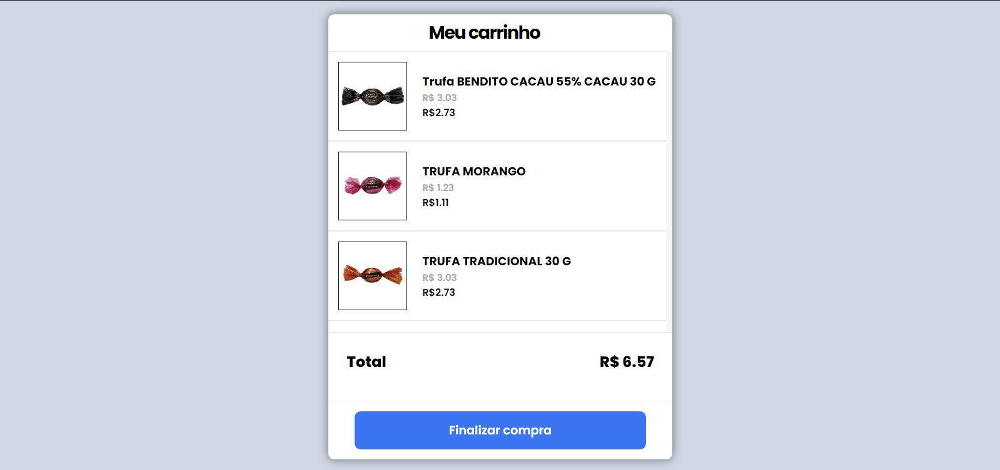

# Codeby - Teste do carrinho

Projeto feito utilizando [ReactJS](https://github.com/facebook/create-react-app) e [TypeScript](https://www.typescriptlang.org/).

## Para rodar o projeto

Primeiramente rode `yarn install` para instalar as dependências necessárias.

Nesse diretório você encontra os seguintes comandos: 

### `yarn start`

Para rodar a aplicação em versão de desenvolvimento.\
Abra [http://localhost:3000](http://localhost:3000) para poder visualizar a aplicação.

### `yarn run`

Para rodar a API que estará rodando em [http://localhost:3300](http://localhost:3300) ---
Para ver o JSON da soma acima de R$10,00 [http://localhost:3300/cima](http://localhost:3300/cima)
Para ver o JSON da soma abaixo de R$10,00 [http://localhost:3300/baixo](http://localhost:3300/baixo)

## Rotas da aplicação
### Página inicial `/`
Nessa rota se encontra o carrinho com soma total dos produtos acima de R$10,00 (Apresenta a mensagem de frete grátis).
### Soma abaixo de 10 `/abaixo-de-dez`
Nessa rota se encontra o carrinho com soma total dos produtos abaixo de R$10,00 (Não apresenta a mensagem de frete grátis).

## Dados utilizados dos arquivos JSON
### items: [
  `id: number;`
  `name: string;`
  `price: number;`
  `imageUrl: string;`
  `sellingPrice: number;`
]
